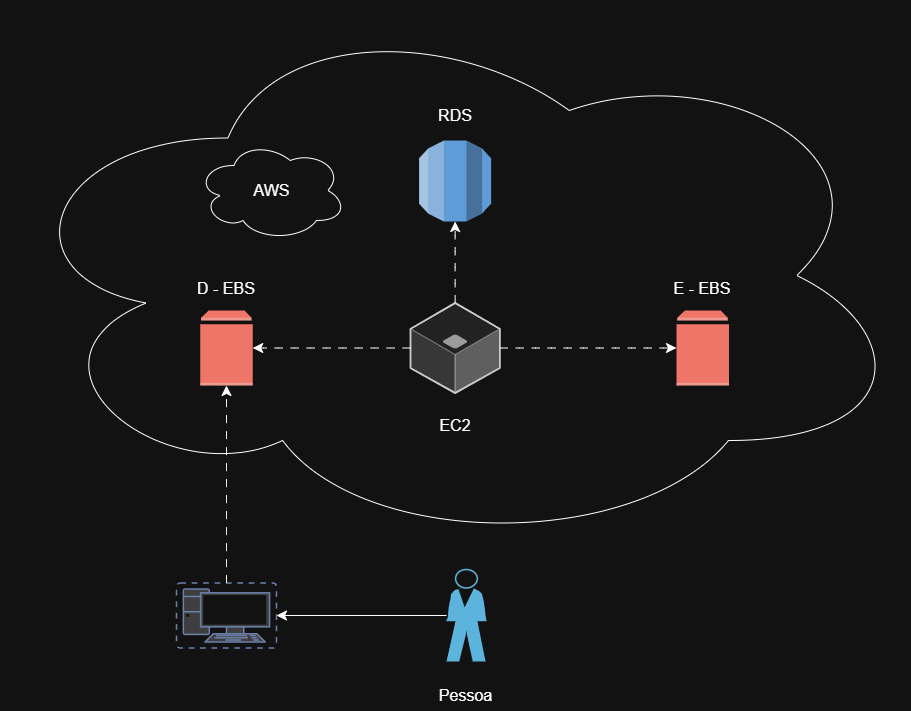
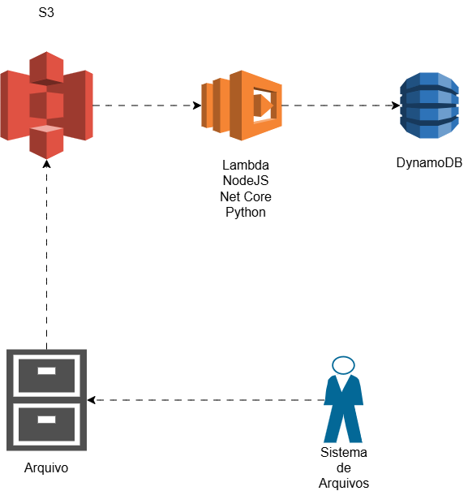

# 🧩 Desafio TQI com DIO

## 🚀 Esse repositório tem por finalidade trazer breves explicações e mostrar os diagramas sobre o curso da TQI.

### 📝 Diagrama 1 - Amazon EC2 com EBS

### 🔍 Conceitos Iniciais
O Amazon EC2 (<strong>Amazon Elastic Compute Cloud</strong>) é responsável pela criação de instâncias, que são servidores virtuais nos serviços da AWS.
Em conjunto ao EC2, tem o Amazon EBS (<strong>Amazon Elastic Block Store</strong>), que adiciona blocos de memória à sua instância, como um computador e um pendrive.
Por fim, o Amazon RDS (<strong>Amazon Relational Database Service</strong>) é o mantenedor e facilitador de configurações de banco de dados na web.

### 🧐 Explicação
O cliente envia algum arquivo para um sistema, e esse arquivo vai para o D - EBS (para a nuvem), que recebe as entradas. O EC2 entra em ação e processa o arquivo do cliente, ele manda os arquivos processados para o E - EBS, que os armazena. E Por fim, depois de validar, manda ao banco de dados pelo RDS.

### 📝 Diagrama 2 - Amazon S3 com Lambda Function

### 🔍 Conceitos Iniciais
O Amazon S3 (<strong>Simple Storage Service</strong>) é responsável pela leitura e gravação de dados. O AWS Lambda cria eventos a outros serviços da AWS ou serviços externos, e o DynamoDB é o banco de dados da AWS NoSQL.

### 🧐 Explicação
O cliente manda um arquivo para o servidor, esse arquivo entra no S3, é processado pelo AWS Lambda, que se conecta ao DynamoDB que guarda os dados.

## 🎓 Conclusão
A AWS (<strong>Amazon Web Service</strong>) tem uma ampla gama de serviços com variáveis custos, que conta com valores gratuitos para certas faixas de uso, o que deixa mais acessível a plataforma para estudantes ou pessoas que estão tentando ingressar na área.
